# 原版魔方演示指南 (Demo Walkthrough)

> 本文档收录了 3D 虚拟魔方与动画制作的基础功能演示。

---

## 虚拟魔方操作

- **触控操作**：支持鼠标/手势划动魔方表面层转，划动空白处旋转整体视角。

  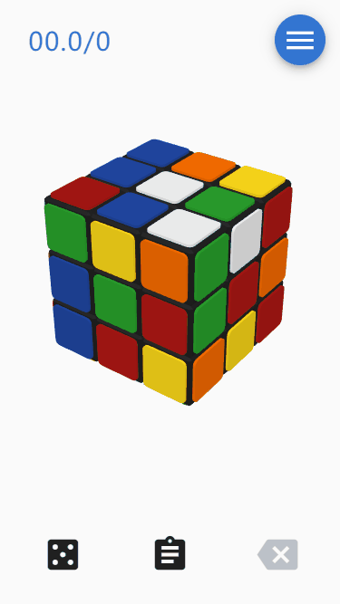

- **撤销操作**：支持步序撤销与重做。

  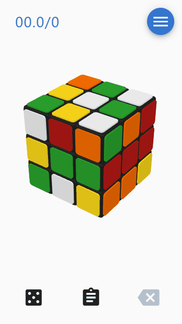

- **操作历史**：实时统计拧动步数并记录完整步骤序列。

  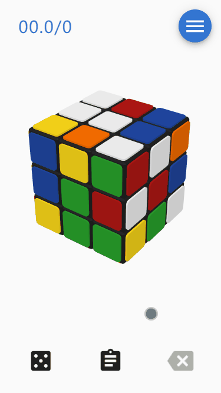

- **自定义打乱**：支持 WCA 标准随机打乱或输入自定义打乱公式。

  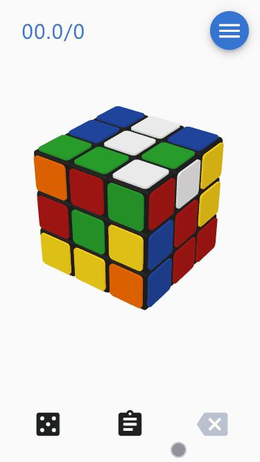

- **复盘播放**：还原完成后可进入复盘模式逐步回放。

  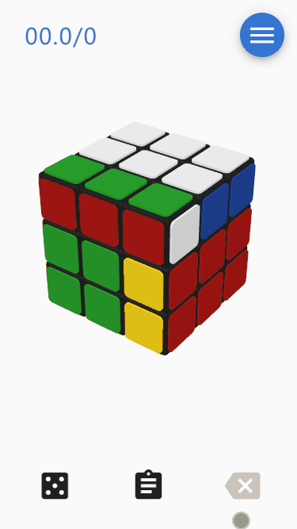

---

## 公式教学与复原

- **公式播放**：内置 F2L / OLL / PLL 等公式库，点击可动态演练。

  

- **公式列表**：分类清晰的公式卡片索引。

  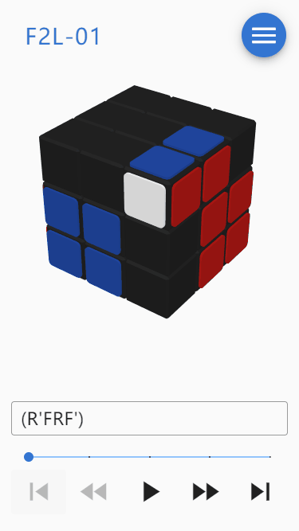

- **单步控制**：支持上一步、下一步、跳转首尾与速度调节。

  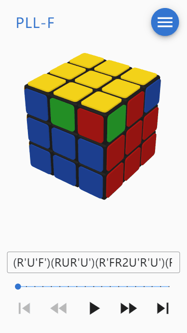

---

## 动画制作与导出

- **场景布置与截图**：自由布置初始状态并高清截图。

  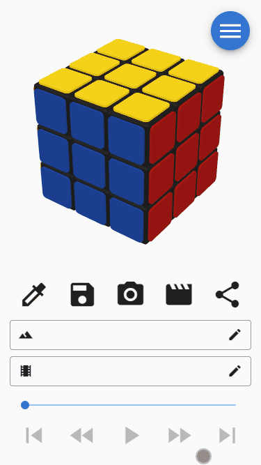

- **动画脚本编写**：支持多公式组合与延时控制。

  

- **导出 GIF / PNG**：一键将魔方动画录制为动图或透明序列帧导出。

  

- **自由涂色**：展开图与 3D 表面交互式点色。

  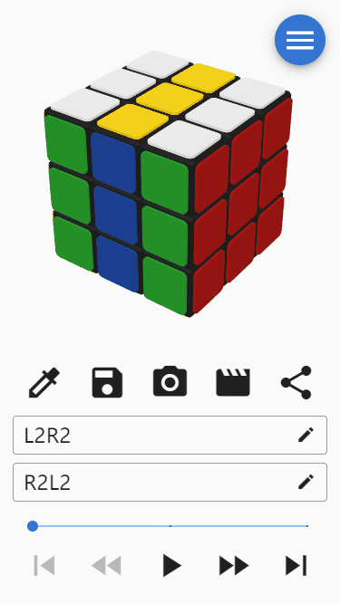

- **输出配置与分享**：

  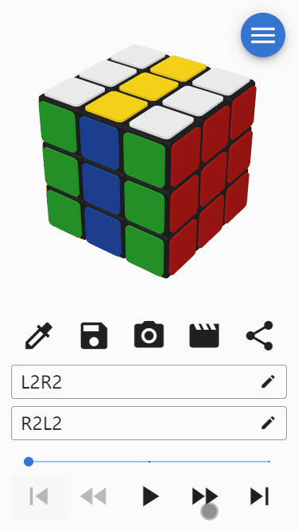
  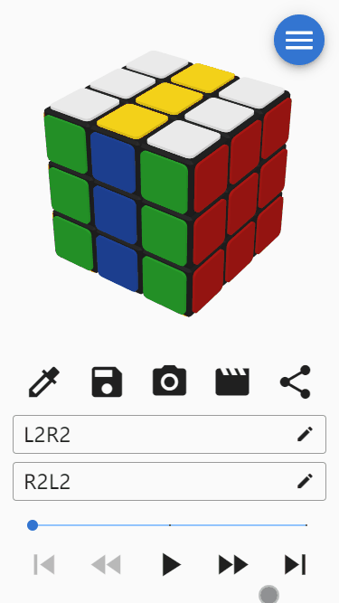

---

## 外观与控制选项

- **高阶支持 (2-10阶)**：

  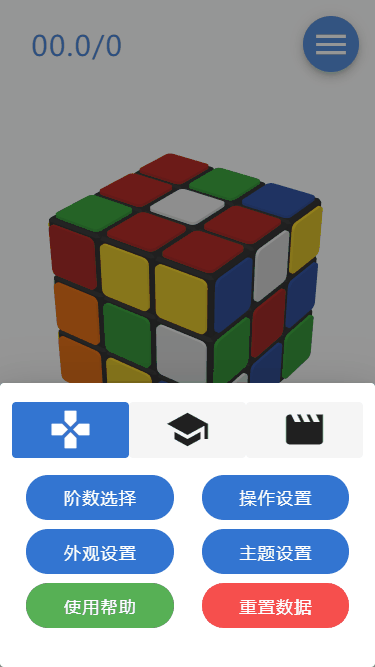

- **控制灵敏度**：

  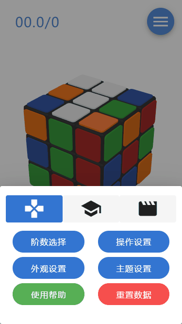

- **厚贴纸与视觉风格**：

  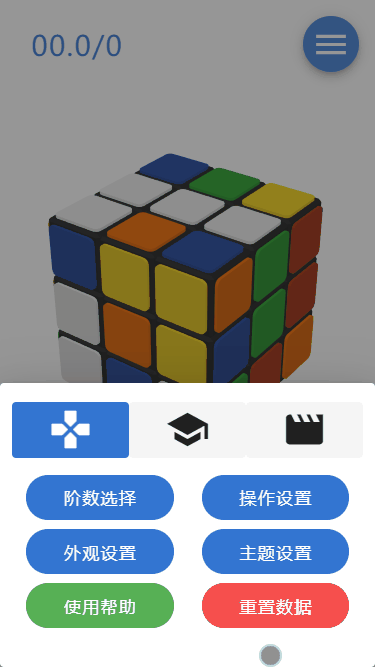

- **主题调色盘**：

  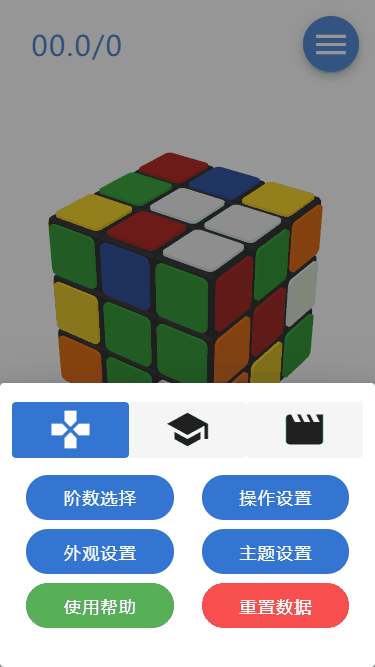
